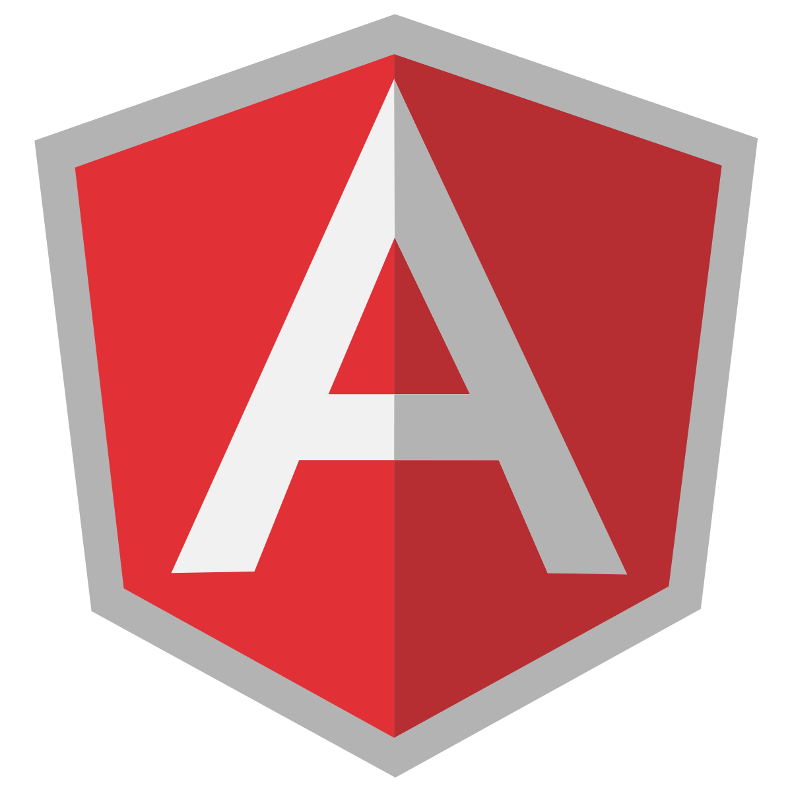

# *__AngularJS__*
## *__in one day__*



---


_@toddmotto_

---

## *__Workshop outline__*

* _9:00 - 10:30_: Angular overview
* _11:00 - 12:30_: Hello world and setups
* _13:30 - 15:00_: Build an application
* _15:30 - 17:00_: App progression/discussions/Q&A

---

# *__Intros!__*


---

# *__Intros__*

* Name, where you're from
* Developer experience
* Angular experience

---

# *__Day prep__*

* A question about Angular that you might want answering
* Something you want to build using Angular

---

> "Don't learn the framework, learn the concepts behind them and apply them"

---

## Single Page Apps

---

# *__Routing__*

* Dynamic routes and views
* XHR templates
* App state driven by URL

---

## MVC + data-binding

---

# *__Model__*

* Application data structure
* JSON

---

# *__View__*

* Components/HTML
* Rendered output

---

# *__Controller__*

* Drives Model and View changes

---

# *__Two way data-binding__*

* Keeps data in sync
* Model changes drive View changes
* View changes drive Model changes

```html
<input type="text" ng-model="vm.searchTerm" />

Searching for: {{ vm.searchTerm }}
```

---

# *__Directives: Manipulating the DOM__*

* Reusable chunks of code injected
* Packaged and managed individually
* Custom buttons, forms, tooltips (components)


---

```js
function FileUpload( ) {
	return {
		scope: {},
		replace: true,
		template: [
			'<div>',
			'</div>'
		].join(''),
		controller: function ( $scope ) {

		}
	};
}

angular
	.module('app')
	.directive('FileUpload', FileUpload);
```

---

# *__Services__*

* Singletons, act as Constructors

```js
function UploadService( $http ) {
	this.uploadFile = function () {
		// upload the file here
	}
}

angular
	.module('app')
	.service('UploadService', UploadService);
```

---

# *__Factory__*

* Singletons, return closures/Objects

```js
function AuthService($http) {
	var AuthService = {};

	AuthService.login = function (username, password) {

	};

	return AuthService;
}

angular
	.module('app')
	.factory('AuthService', AuthService);
```

---

# *__Filters__*

* Managing your data
* Single filtering (non-loop)
* Multiple ways to create

```html
<div class="timestamp">
	{{ vm.timestamp | date:'yyyy-mm-dd' }}
</div>
```

---

# *__Creating your first app__*

* _Design:_ JSON design for best response
* _Distribute:_ Integrate data with Factory+Controllers
* _Declare:_ Push to the $scope

---

# *__Core Functions__*

* ng-* attributes (internal directives)

```html
<a href="" ng-click="vm.submitForm()">
	Submit
</a>
```

---

# *__Expressions__*

* Inline Javascript expression operators

```html
{{ vm.authorised && 'Welcome!' || 'Please login'}}
```

---

# *__Routing__*

* Dynamic views, used with _ng-view_

```js
function Router($routeProvider, $locationProvider) {
    $routeProvider
    .when('/inbox', {
        templateUrl: 'views/mailbox.html',
        controller: 'InboxCtrl as vm',
        resolve: InboxCtrl.resolve
    })
    .when('/email/:id', {
        templateUrl: 'views/email.html',
        controller: 'EmailCtrl as vm',
        resolve: EmailCtrl.resolve
    }).otherwise({ redirectTo: 'inbox' });
};

angular
    .module('app')
    .config(Router);
```

---

# *__Dependency Injection__*

* The Angular want you want
* Minification

```js
function AuthService($scope, $rootScope) {
    
};
AuthService.$inject = ['$scope', '$rootScope'];
angular
    .module('app')
    .controller('AuthService', AuthService);
```

---

# *__Thinking Angular (ng-thinking)__*

* Scopes and data, not DOM, no add/remove/toggle classes, ever. Angular does this all for you based on data
* Let the data do the work, keep code as minimal as possible
* Abstract, abstract, abstract. Keep abstracting into different files for better management and copying individual files into new projects, premade working code.

---

# *__Questions?__*

---

# *__Email app__*

> github.com/toddmotto/fowa-2014

# *__Module__*

```js
angular
	.module('app', []);
```

---

# *__Router__*

```js
function Router( $routeProvider, $locationProvider ) {

};

angular
	.module('app')
	.config(Router);
```

---

# *__Router__*

```js
function Router( $routeProvider, $locationProvider ) {
	$routeProvider
		.when('/inbox', {
			templateUrl: 'views/mailbox.html',
			controller: 'InboxCtrl as vm',
			resolve: InboxCtrl.resolve
		})
		.when('/sent', {
			templateUrl: 'views/mailbox.html',
			controller: 'SentCtrl as vm',
			resolve: SentCtrl.resolve
		})
		.when('/email/:id', {
			templateUrl: 'views/email.html',
			controller: 'EmailCtrl as vm',
			resolve: EmailCtrl.resolve
		})
		.otherwise({
			redirectTo: 'inbox'
		});
};

angular
	.module('app')
	.config(Router);
```

---

# *__Mailbox Factory__*

```js
function MailboxFactory( $http ) {

	var MailboxFactory = {};
	return MailboxFactory;
}

angular
	.module('app')
	.factory('MailboxFactory', MailboxFactory);
```

---

# *__Mailbox Factory__*

```js
function MailboxFactory( $http ) {

	var MailboxFactory = {};

	MailboxFactory.data = {
		sentEmails: {},
		loadedEmail: {}
	};

	MailboxFactory.searchTerm = {};

	MailboxFactory.getEmail = function( id ) {
		return MailboxFactory.data.loadedEmail = $http(
			{
				method: 'GET',
				url: '/rest/emails/' + id + '.json'
			}
			);
	};

	MailboxFactory.getSentEmails = function( ) {
		return MailboxFactory.data.sentEmails = $http(
			{
				method: 'GET',
				url: '/rest/sent.json'
			} );
	};

	MailboxFactory.getInboxEmails = function( ) {
		var emails =
			MailboxFactory.data.inboxEmails || (
				MailboxFactory.data.inboxEmails = $http(
				{
					method: 'GET',
					url: '/rest/inbox.json'
				} ) );

		return emails;
	};

	return MailboxFactory;
}

angular
	.module('app')
	.factory('MailboxFactory', MailboxFactory);
```

---

# *__App Controller__*

```js
function AppCtrl( $location, MailboxFactory ) {

}

angular
	.module('app')
	.controller('AppCtrl', AppCtrl);
```

---

# *__Email Controller__*

```js
function EmailCtrl( MailboxFactory ) {
	
}
angular
	.module('app')
	.controller('EmailCtrl', EmailCtrl);
```

---

# *__Email Controller__*

```js
function EmailCtrl( MailboxFactory, $$getEmail ) {
	this.email = $$getEmail.data;
}

EmailCtrl.resolve = {
	'$$getEmail': function( MailboxFactory, $route ) {
		return MailboxFactory.getEmail( $route.current.params.id );
	}
};

angular
	.module('app')
	.controller('EmailCtrl', EmailCtrl);
```

# *__Inbox Controller__*

```js
function InboxCtrl( MailboxFactory ) {
}

angular
	.module('app')
	.controller('InboxCtrl', InboxCtrl);
```

# *__Inbox Controller__*

```js
function InboxCtrl( MailboxFactory, $$getInbox ) {
	this.items = $$getInbox.data;
	
	this.searchTerm = MailboxFactory.searchTerm;
}

InboxCtrl.resolve = {
	'$$getInbox': function( MailboxFactory ) {
		return MailboxFactory.getInboxEmails();
	}
};

angular
	.module('app')
	.controller('InboxCtrl', InboxCtrl);
```

# *__Sent Email Controller__*

```js
function SentCtrl( ) {
}

angular
	.module('app')
	.controller('SentCtrl', SentCtrl);
```

# *__Sent Email Controller__*

```js
function SentCtrl( $$getSent ) {
	this.items = $$getSent.data;
}

SentCtrl.resolve = {
	'$$getSent': function( MailboxFactory ) {
		return MailboxFactory.getSentEmails();
	}
};

angular
	.module('app')
	.controller('SentCtrl', SentCtrl);
```

# *__Compose Email Directive__*

```js
function composeEmail( ) {
	return {
		restrict: 'EA',
		scope: true,
		replace: true,
		template: [
			''
		].join(''),
		controllerAs: 'vm',
		controller: function( $scope ) {
		}
	};
}

angular
	.module('app')
	.directive('composeEmail', composeEmail);
```

# *__Compose Email Directive__*

```js
function composeEmail( ) {
	return {
		restrict: 'EA',
		scope: true,
		replace: true,
		template: [
			'<div class="compose" ng-show="vm.show">',
				'<div class="compose__header">',
					'Compose New Email',
					'<span class="compose__header--close" ng-click="vm.close()">',
						'<i class="fa fa-times fa-fw"></i>',
					'</span>',
				'</div>',
				'<div class="compose__message">',
					'<input type="text" ng-model="vm.to" placeholder="To.." />',
					'<input type="text" ng-model="vm.subject" placeholder="Subject" />',
					'<textarea ng-model="vm.emailText" placeholder="Click to compose.."></textarea>',
					'<a class="button" href="">Send</a>',
				'</div>',
			'</div>'
		].join(''),
		controllerAs: 'vm',
		controller: function( $scope ) {
			var vm = this;

			vm.show = true;

			vm.to = '';
			vm.subject = '';
			vm.emailText = '';

			vm.close = function () {
				vm.show = false;
			};

			$scope.$on('compose:show', function () {
				vm.to = '';
				vm.subject = '';
				vm.emailText = '';
				vm.show = true;
			} );
		}
	};
}

angular
	.module('app')
	.directive('composeEmail', composeEmail);
```